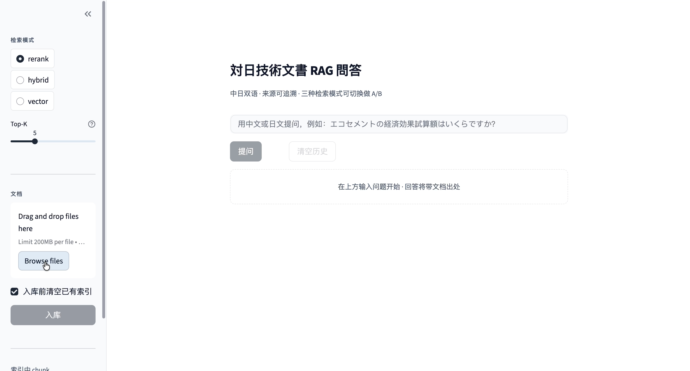

# 对日技术文档智能问答系统（Nihon Doc QA）

> 一个面向对日 IT 项目场景的 RAG 系统：上传日文 / 中日混排技术文档（设计书、规格书、操作手册），用自然语言提问，系统基于文档内容用中日双语回答，并标注来源出处。

## 演示



### 同一道日文问题，切换检索模式，结果不同

| rerank（默认） | vector（基线） |
|---|---|
|  |  |
| ✅ `エコセメントの経済効果試算額は **5920億4百万円** です（[1] p.61）。` | ❌ `資料中未找到相关内容。` |

> 同一份 264 chunk 的日文 PDF、同一道问题——纯向量检索找不到深埋第 61 页的数值；
> rerank 模式（向量 + BM25 RRF 融合 + 交叉编码器精排）准确召回并回答。
>
> **测试集 12 题：关键词命中率 67% → 92%（+25pp）；LLM-as-judge 通过率 83% → 92%**。
> 评估方法详见 [`docs/evaluation-report.md`](docs/evaluation-report.md) 和 [`docs/week3-notes.md`](docs/week3-notes.md)。

> 🚧 在线试用：将在 Week 5 部署到 Hugging Face Spaces 后补充链接。

---

## 背景与动机

在 对日 IT 项目经验中，我反复遇到一个痛点：项目的设计书、规格书动辄数百页，且常是中日混排，查找一个具体的业务细节往往要花大量时间翻阅。本项目尝试用 RAG（检索增强生成）技术解决这个真实问题——让团队成员用自然语言直接向文档提问，并得到可溯源的中日双语回答。

这个项目特别针对对日场景做了优化：中日混排文档解析、日文专有名词的精准检索、回答语言自动适配。

---

## 核心特性

- 📄 支持中日混排技术文档的解析与切块
- 🔍 混合检索（向量检索 + BM25 关键词检索），解决日文专有名词、型号检索不准的问题
- 🎯 重排序（Rerank）二次精排，提升检索精度
- 🌐 中日双语回答，根据提问语言自动适配
- 📌 来源标注，每个回答附带文档名与页码，可核对溯源
- 🐳 Docker 一键部署

---

## 系统架构

<!-- 放 docs/architecture.png 架构图 -->


整体流程分两条线：

文档侧（离线）：技术文档 → PDF 解析 → 切块 → 向量化 → 存入向量库

问答侧（在线）：用户提问 → 混合检索（向量 + BM25）→ 重排序 → 拼接 prompt → 大模型生成 → 中日双语回答（含来源标注）

---

## 技术选型


| 环节 | 技术 | 选型理由 |
|------|------|---------|
| 文档解析 | PyMuPDF | 处理 PDF 稳定，对日文字体兼容好 |
| Embedding | bge-m3 | 支持中日多语言，适配混排文档 |
| 向量库 | Chroma | 轻量、本地可跑、易于演示 |
| 关键词检索 | BM25 | 补足向量检索对专有名词不敏感的短板 |
| 重排序 | bge-reranker | 对检索结果二次精排，提升准确率 |
| 大模型 | Deepseek API | 通过 API 调用，无需自建推理服务 |
| 界面 | Streamlit | 快速构建可演示的交互界面 |
| 部署 | Docker | 环境一致、一键启动 |

---

## 关键设计决策

> 真正做过的优化，按"问题 → 方案 → 效果"写。下面是示例，替换成你的真实数据。

### 为什么引入混合检索？

纯向量检索在处理日文专有名词和产品型号时，容易因语义相近而召回错误内容。我引入 BM25 关键词检索与向量检索做融合（RRF），让精确匹配的关键词也能被有效召回。在我的测试集上，检索准确率从 约X% 提升到 约Y%。

### 为什么加入重排序？

初步检索召回的 top-k 结果中，相关度排序并不总是准确。加入 bge-reranker 对候选结果二次排序后，最相关的内容更稳定地排在前列，回答质量明显改善。<放一组优化前/后的对比例子>

---

## 快速开始

```bash
# 1. 克隆项目
git clone https://github.com/<你的用户名>/nihon-doc-qa.git
cd nihon-doc-qa

# 2. 安装依赖
pip install -r requirements.txt

# 3. 配置环境变量（复制模板，填入你的 API Key）
cp .env.example .env
# 编辑 .env，填入 API_KEY

# 4. 启动
streamlit run app.py
```

### 使用 Docker

```bash
docker build -t nihon-doc-qa .
docker run -p 8501:8501 --env-file .env nihon-doc-qa
```

---

## 评估

> 有数据的项目可信度高很多。哪怕是简单的人工评估也要写。

在一个包含 <N> 个问题的测试集上进行评估：

| 配置 | 准确率 |
|------|--------|
| 朴素 RAG | 约 X% |
| + 混合检索 | 约 Y% |
| + 重排序 | 约 Z% |

> 评估方法、测试集见 `eval/` 目录。

---

## 项目结构

```
nihon-doc-qa/
├── src/            # 核心模块（解析、向量化、检索、生成）
├── app.py          # Streamlit 界面
├── eval/           # 评估脚本与测试集
└── docs/           # 架构图、演示录屏
```

---

## 后续可优化方向

> 写这一节表明你有产品思维、知道系统的边界，是加分项。

- 支持更多文档格式（Word、Excel、扫描件 OCR）
- 引入对话历史，支持多轮追问
- 增加表格、图片内容的理解
- 针对超大文档库的检索性能优化

---

## 关于作者

> 一句话点出你的差异化定位，吸引 HR 继续了解你。

具有 9 年对日 IT 项目经验（PG → PL）、日语 N1、PMP 认证。正在向 AI 应用工程方向发展，擅长将真实业务痛点转化为 AI 解决方案。

---

> 注：本项目使用 AI 辅助开发。所有技术选型、架构设计与优化决策由本人主导完成。
> 测试文档均为公开资料或脱敏数据，不含任何真实客户信息。
