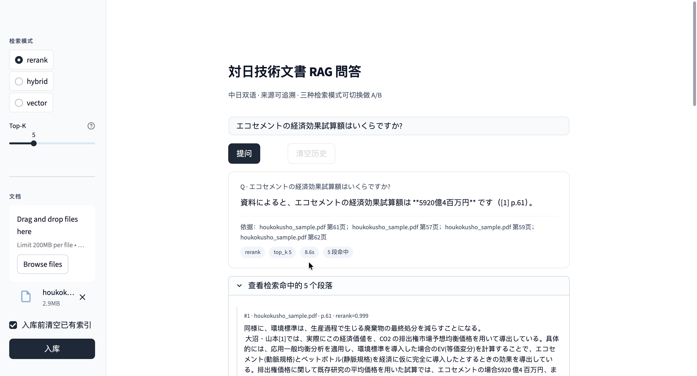
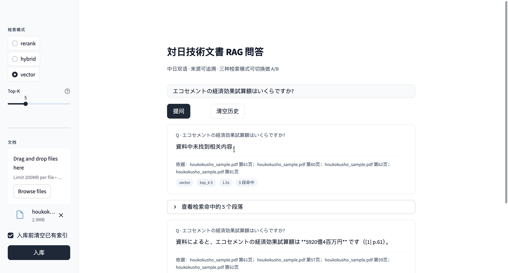

# 对日技术文档智能问答系统（Nihon Doc QA）

> 一个面向对日 IT 项目场景的 RAG 系统：上传日文 / 中日混排技术文档（设计书、规格书、操作手册），用自然语言提问，系统基于文档内容用中日双语回答，并标注来源出处。

## 演示


### 同一道日文问题，切换检索模式，结果不同

| rerank（默认） | vector（基线） |
|---|---|
|  |  |
| ✅ `エコセメントの経済効果試算額は **5920億4百万円** です（[1] p.61）。` | ❌ `資料中未找到相关内容。` |

> 同一份 264 chunk 的日文 PDF、同一道问题——纯向量检索找不到深埋第 61 页的数值；
> rerank 模式（向量 + BM25 RRF 融合 + 交叉编码器精排）准确召回并回答。
>
> **测试集 12 题：关键词命中率 67% → 92%（+25 pp）；LLM-as-judge 通过率 83% → 92%**。
> 评估方法详见 [`docs/evaluation-report.md`](docs/evaluation-report.md)。

> 🚧 在线试用：将在部署到 Hugging Face Spaces 后补充链接。

---

## 背景与动机

在对日 IT 项目经验中我反复遇到一个痛点：设计书、规格书动辄数百页，常是中日混排，
查找一个具体的业务细节往往要花大量时间翻阅。本项目把 RAG（检索增强生成）应用到这个
真实场景——让团队成员用自然语言直接向文档提问，并得到**可溯源**的中日双语回答。

针对对日场景做了三个差异化：

- **中日混排文档解析**：NFKC 全角半角归一、清理 PDF 提取的段内伪换行（实测有 1874 处）。
- **日文专有名词的精准检索**：自写中日 bigram 分词驱动 BM25，与向量检索 RRF 融合。
- **回答语言自动适配**：粗粒度语言识别，日文问→日文答，中文问→中文答。

---

## 核心特性

- 支持中日混排技术文档的解析、切块、向量化、入库
- **三种检索模式**可热切换：`vector` / `hybrid`（向量 + BM25 RRF 融合）/ `rerank`（再加交叉编码器精排）
- 中日双语回答，根据提问语言自动适配
- 每个回答附带文档名与页码，**可溯源**
- 双轨评估：关键词命中（零成本）+ LLM-as-judge（鲁棒、识别同义/跨语言）
- Docker 一键部署，HF Spaces 友好

---

## 系统架构

```
                     ┌──────────────────────────────────┐
   ┌──── 文档侧（离线） ──────────┐                          │
   │                              │                          │
   │   PDF / TXT                  │                          │
   │       ↓ PyMuPDF              │                          │
   │   文本规整（NFKC、清伪换行） │   ┌────────────────┐     │
   │       ↓                      │   │  Chroma 向量库 │     │
   │   字符滑窗切块               ├──→│  +             │     │
   │       ↓                      │   │  BM25 索引     │     │
   │   bge-m3 embedding           │   └────────┬───────┘     │
   │                              │            │              │
   └──────────────────────────────┘            │              │
                                               │              │
   ┌──── 问答侧（在线） ──────────┐            ▼              │
   │                              │   ┌────────────────────┐  │
   │   用户提问                   │   │ HybridRetriever    │  │
   │       ↓                      ├──→│  vector + BM25     │  │
   │   语言识别 / 模式选择        │   │  → RRF 融合        │  │
   │       ↓                      │   │  → bge-reranker    │  │
   │   prompt 组装                │   │     交叉编码器精排 │  │
   │       ↓                      │   └─────────┬──────────┘  │
   │   Deepseek API               │             │              │
   │       ↓                      │             │              │
   │   中日双语回答 + 出处脚注    │←────────────┘              │
   │                              │                             │
   └──────────────────────────────┘                             │
                                                                │
                                                                ▼
```

---

## 技术选型

| 环节 | 选型 | 选型理由 |
|------|------|---------|
| 文档解析 | PyMuPDF | PDF 处理稳定；日文字体提取可控（已识别并修复段内伪换行问题） |
| Embedding | `BAAI/bge-m3` | 多语言、中日跨语言检索表现好、归一化向量 |
| 向量库 | Chroma | 轻量、本地可跑、cosine 距离原生支持 |
| 关键词检索 | `rank_bm25` + 自写中日 bigram 分词 | 不引入 MeCab/jieba 重依赖即可处理日文 |
| 重排序 | `BAAI/bge-reranker-v2-m3` | 交叉编码器，对融合候选做精确二次排序 |
| 大模型 | DeepSeek API（`deepseek-chat`，OpenAI 兼容） | RAG 生成只需"基于上下文作答"，chat 模型在成本/延迟上比推理模型更划算 |
| 界面 | Streamlit | 几十行代码出可交互 demo，支持模式热切换做 A/B |
| 容器 | Docker | HF Spaces 原生支持，本地复现一致 |

---

## 关键设计决策

### 1. 混合检索（BM25 + 向量，RRF 融合）

**问题**：纯向量检索在日文缩写（`ITU-T`、`ANSI`、`JNLA`）和专有编号上不可靠，
向量会把语义相近的段落都召回，混进噪声。

**方案**：自写中日友好分词（ASCII 型号整词保留 + CJK bigram），驱动 BM25 与向量
并行召回，用 **RRF（Reciprocal Rank Fusion）** 融合。只看排名不看原始分，规避
"向量距离"与"BM25 分"量纲不可比。

**效果**（实测，诚实记录）：
- 最终命中率：vector 67% → hybrid 75%。**这里要诚实**：在我们用的测试集上 bge-m3
  本来表现就不弱，hybrid 的增益主要不在最终命中率，而在**召回层**——把正确段落更
  稳定地捞进候选池，给下一步 rerank 创造条件。

### 2. 重排序（交叉编码器精排）

**问题**：混合检索的 top-k 里，**正确的段落不一定排在前列**。尤其当答案藏在
"主题混杂 chunk"末尾时，向量和 RRF 都会被段落整体语义带偏。

**方案**：用 `bge-reranker-v2-m3` 对 RRF 后的 candidate_k=20 候选做二次精排，
取 top-k 喂给 LLM。

**效果**：命中率 75% → **92%**（+17 pp）。两个干净的归因例子：

| 题目 | vector | hybrid | rerank |
|---|---|---|---|
| Q10「エコセメントの経済効果試算額（5920億）」 | ❌ | ❌ | ✅ |
| Q11「ITU-T が指す略称」 | ❌ | ❌ | ✅ |

因为 hybrid 和 rerank 喂给 LLM 的**候选池是同一批**（RRF 融合后的 top-20），
hybrid 答不出但 rerank 答对，证明是 rerank 的精排能力，**不是 LLM 蒙的**。

### 3. 沿途修了个真 bug：日文 PDF 段内伪换行

跑评估时发现 Q7「改正工業標準化法の施行予定」三种模式全 ❌，原文 p.4 明明有这句。
深挖发现 PyMuPDF 按视觉行提取，日文版式每 30 字左右换一次行，
原文 `改正/n工業標準化法` 被一个伪换行打断。**全文统计 1874 处**这种 CJK 字符间
伪换行，污染了所有跨视觉行的长词（IEC、ITU-T 的全称等）。

修复：`src/text_utils.py` 新增正则只清 CJK 字符之间的**单个**换行，保留 `\n\n+`
真段落分隔。验证：1874 → 0，段落结构未破坏。

### 4. 留给生产环境的优化：「主题混杂 chunk」

修完伪换行后 Q7 仍偶发失败。深挖发现 chunk #8 是一个 500 字段落，前 400 字讲
WTO/TBT 背景，**答案藏在末尾 70 字**——向量和 cross-encoder 按整段语义打分，
都把它判为"不相关"。这是 RAG 经典的 needle-in-haystack 失败模式。

**本项目未实施修复**，但在 [`docs/week3-notes.md`](docs/week3-notes.md) 给出生产环境
的分档方案：调大 top_k + score-gap aware 融合（🟢立即）→ Small-to-Big 检索 +
语义切块（🟡中期）→ **Anthropic Contextual Retrieval**（🔴最优，失败率降 35-49%）。
诚实记录"没做但知道怎么做"，比堆所有时髦技术更体现工程判断。

---

## 评估

测试集 12 题（中日双语，文档 `samples/houkokusho_sample.pdf`，264 chunk）。
**两种判分方式并存**，互为印证：

| 模式 | 关键词命中率 | LLM-as-judge 通过率 |
|------|------|------|
| `vector` | 67% (8/12) | 83% (10/12) |
| `hybrid` | 75% (9/12) | 92% (11/12) |
| `rerank` | **92% (11/12)** | **92% (11/12)** |

**vector 67 vs 83 的 gap** 说明：LLM 裁判识别出 4 个"答案对但用词不同"的回答——
这正是为什么不能只用关键词命中评估。**rerank 92/92 收敛** 说明回答和关键词
高度对齐，评分方法稳定。

完整逐题对比见 [`docs/evaluation-report.md`](docs/evaluation-report.md)；
评估脚本：

```bash
python eval/evaluate.py --all-modes --judge llm
```

---

## 快速开始

```bash
git clone https://github.com/<你的用户名>/nihon-doc-qa.git
cd nihon-doc-qa

python -m venv .venv && source .venv/bin/activate
pip install -r requirements.txt

cp .env.example .env   # 填入你的 LLM_API_KEY

python -m streamlit run app.py   # 浏览器自动打开 http://localhost:8501
```

### 使用 Docker

```bash
docker build -t nihon-doc-qa .
docker run --rm -p 8501:8501 \
  -e LLM_API_KEY=$LLM_API_KEY \
  -v $(pwd)/.cache:/app/.cache/huggingface \
  nihon-doc-qa
```

挂载 `.cache` 是为了让 bge-m3 / reranker 只下载一次。详见
[`docs/deployment.md`](docs/deployment.md)（含 Hugging Face Spaces 部署步骤）。

### 性能 / 延迟（按硬件分档）

bge-reranker-v2-m3 是 cross-encoder，需要对每个候选跑完整 Transformer forward pass。
**纯向量（双塔）模式可以在 CPU 上秒级返回，rerank 模式对硬件敏感**：

| 硬件 | rerank 模式单次问答 | vector / hybrid 模式 |
|---|---|---|
| 本地 Mac（M 系列，有 AMX/NEON 加速） | **4-8 秒** | 1-2 秒 |
| HF Spaces CPU Basic（2 vCPU，免费层） | **40-60 秒**（首次含模型加载 ~150 秒）| 2-3 秒 |
| HF Spaces CPU Upgrade（~$0.03/h） | 10-20 秒 | 1-2 秒 |
| 任何 GPU（T4 / L4 / A10） | **1-2 秒** | < 1 秒 |

**这是有意的选型 trade-off**：为了达到 92% 的命中率选择了较重的 cross-encoder rerank
模型，代价是在免费 CPU 层延迟较高。生产环境会用 GPU 或换更小的 reranker
（`bge-reranker-base` 约 1/2 大小，速度翻倍但中日多语言能力略降）。

> 在线 demo（HF Spaces 免费层）建议用 `vector` 或 `hybrid` 模式做快速体验，
> rerank 模式仅用于演示"完整管线 + 最高准确率"。

---

## 项目结构

```
nihon-doc-qa/
├── app.py                    # Streamlit 界面（含全局 CSS 简约主题）
├── src/
│   ├── config.py             # 集中读 .env
│   ├── loader.py             # PyMuPDF 解析 + 字符滑窗切块
│   ├── text_utils.py         # NFKC 归一、清 CJK 间伪换行、粗语言识别
│   ├── tokenizer.py          # 中日友好分词（ASCII 整词 + CJK bigram）
│   ├── embedding.py          # bge-m3 Embedder（惰性加载）
│   ├── bm25_index.py         # BM25Okapi 索引，从向量库 get_all 重建
│   ├── vectorstore.py        # Chroma 持久化封装
│   ├── retriever.py          # HybridRetriever + reciprocal_rank_fusion
│   ├── reranker.py           # bge-reranker-v2-m3 交叉编码器
│   ├── generator.py          # prompt 组装 + Deepseek 调用 + 语言路由
│   └── pipeline.py           # ingest + answer 编排
├── eval/
│   ├── test_questions.json   # 12 道中日双语测试问题
│   └── evaluate.py           # 关键词 + LLM-as-judge 双轨判分
├── scripts/                  # 各阶段验收脚本（test_llm/chunking/retrieval/...）
├── samples/                  # 测试用日文 PDF（公开报告，无客户信息）
├── docs/
│   ├── week1-notes.md … week4-notes.md   # 每周复盘
│   ├── retrieval-comparison.md           # 三模式逐题对比
│   ├── evaluation-report.md              # 评估报告
│   ├── deployment.md                     # Docker + HF Spaces 部署
│   ├── demo-script.md                    # 截图/录屏指南
│   ├── known-issues.md                   # 已知问题清单
│   └── screenshots/                      # README 用截图
├── Dockerfile / .dockerignore / .streamlit/config.toml
└── requirements.txt
```

---

## 已知问题与后续优化方向

| 类别 | 内容 | 状态 |
|---|---|---|
| 文档格式 | 仅支持 PDF / TXT / MD，不支持 Word / Excel / 扫描件 OCR | 待加 |
| 切块策略 | 固定字符窗口，会切散语义边界（见"主题混杂 chunk"） | 待改为语义切块 / Small-to-Big |
| 检索召回 | 答案在 chunk 末尾 + chunk 整体语义无关时召回不稳 | 待上 Contextual Retrieval |
| 对话历史 | 单轮问答，不支持多轮追问 | 待加 |
| 表格 / 图片 | PDF 中的表格和图片暂未识别 | 待加 OCR + 视觉理解 |
| 持续评估 | 现仅 12 题手工标注集 | 待扩到 50+ 题 + 自动回归 |
| 推理延迟 | rerank 模式在 HF CPU Basic 上 40-60 秒/次（详见上方"性能 / 延迟"表） | 生产环境用 GPU 或换小型 reranker |

工程判断详见各 `docs/weekN-notes.md`。

---

## 关于作者

> 9 年对日 IT 项目经验（PG → PL），日语 N1，PMP。
> 正在向 AI 应用工程方向发展，擅长把真实业务痛点转化成 AI 解决方案。
> 本项目所有技术选型、架构设计与优化决策由本人主导完成。

---

> 注：本项目使用 AI 辅助开发（Claude Code）。
> 测试文档为公开资料（経済産業省 平成16年度標準化経済性研究会報告書），
> 不含任何真实客户信息。
